# 产品概览

Helm One 是一台**骑行码表**：一块 240×320 的半透半反屏，三个实体键，没有触摸。
它自己带 GNSS 和矢量地图，能离线导航、记轨迹；也能通过蓝牙连心率带、踏频计、功率计，
把骑行数据实时显示出来。配套一个手机 App 做配置、看记录、以及固件升级。

整机基于 **openvela**（见 [08-openvela与参赛.md](08-openvela与参赛.md)），不带触摸屏 ——
车把正对太阳时电容屏反光、戴手套点不准，这是选实体键的原因。

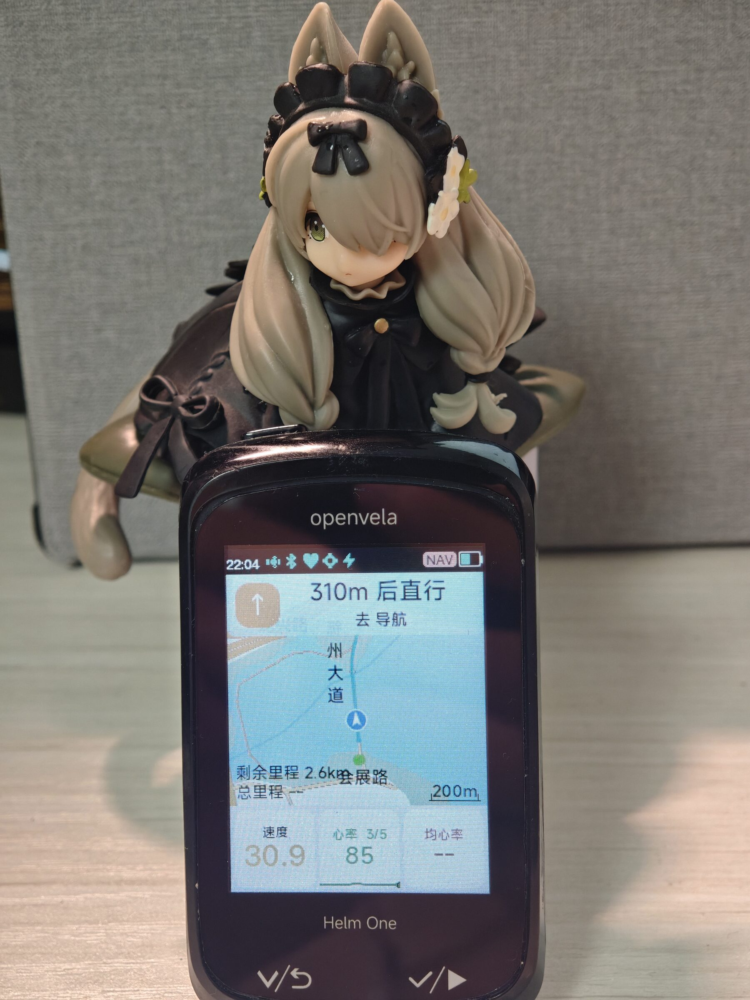

> 实拍：上边框印着 `openvela`，下边框是 `Helm One`；屏幕上是导航页
> （「310m 后直行」+ 地图 + 底部时速/心率）。

## 五个界面

设备上只有五个页面，用右侧两个键翻。所有页面都是**黑字 + 彩色形状**——半透半反屏上
彩色小字对比度不够（橙色只有 2.66:1），所以颜色只用来画色条、量条、环，不用来写字。

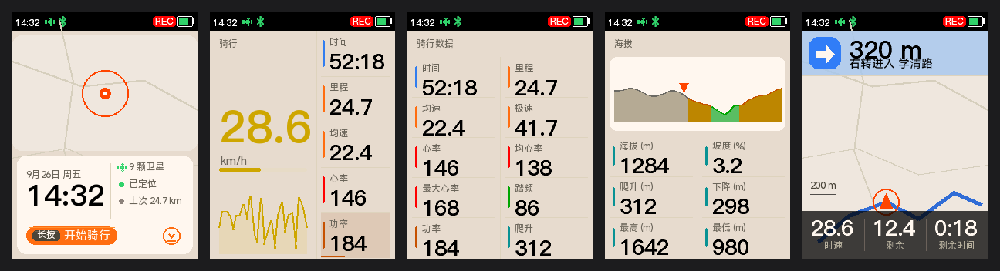

| # | 页面 | 说明 |
|---|---|---|
| 1 | **主界面** | GPS/地图页。左上地图卡，左下日期与时间，右侧状态列（卫星数、定位状态、上次里程）。页面下方是「长按 开始骑行」的操作区 |
| 2 | **骑行** | 主数据页。左边是时速大数字（`28.6 km/h` 占满左卡），右边五行长驻数据，底部一条走势曲线 |
| 3 | **完整数据** | 十项两列：时间、里程、均速、极速、心率、均心率、最大心率、踏频、功率、爬升 |
| 4 | **海拔** | 上部海拔剖面（按坡度分段着色：绿/黄/红），下部六项：海拔、坡度、爬升、下降、最高、最低 |
| 5 | **导航地图** | 地图 + 顶部转向提示（箭头 + 距离 + 路名），底部三格：时速 / 剩余距离 / 剩余时间 |

单页大图：

| 主界面 | 骑行 | 完整数据 | 海拔 | 导航地图 |
|---|---|---|---|---|
| 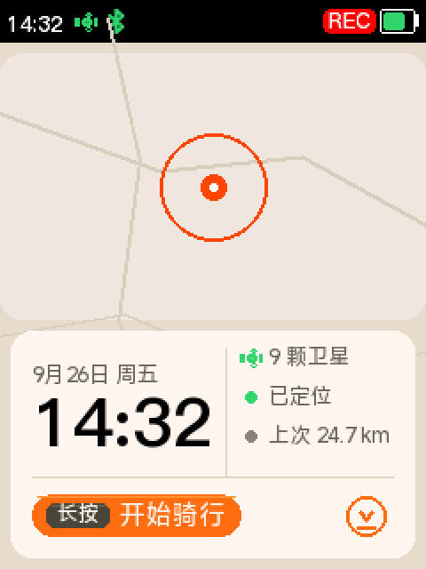 | 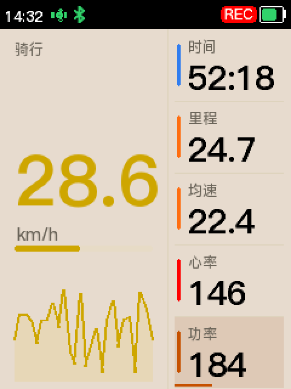 | 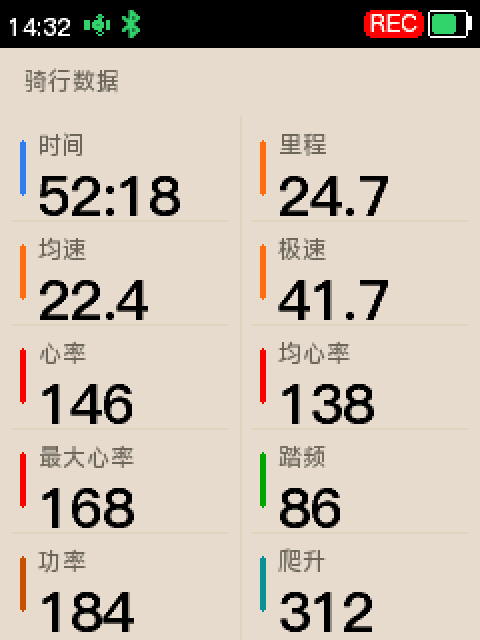 | 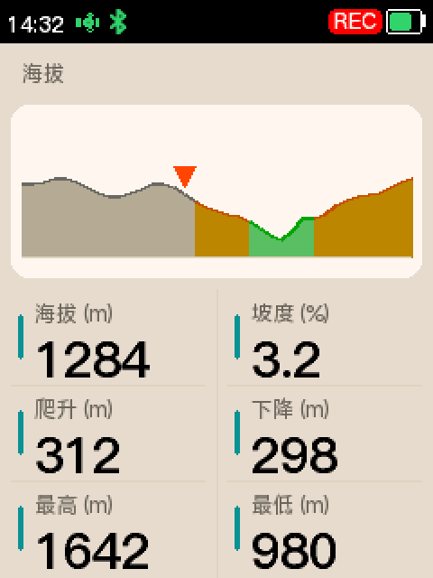 | 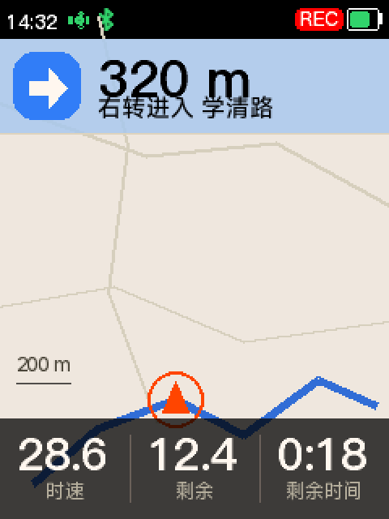 |

> 上面这些是**预览器渲染图**，不是实拍。它解析的是固件里同一份字体 C 数组、复刻了同一份
> `helm_color()`，颜色和字号与板上像素一致，但**地图是示意的**（真机是矢量渲染），
> 卫星颗数等数字是写死的假数据。实拍见下面的待补项。

## 交互

只有三个键，全部是**短按/长按**两种手势，没有滑动：

| 键 | 短按 | 长按 |
|---|---|---|
| **KEY1** | 上一页 | 打开菜单 |
| **KEY2** | 下一页 | 开始 / 暂停骑行 |
| **PWR** | 切换亮度 | — |

因为 KEY2 在右边，主界面的「长按 开始骑行」提示就画在屏幕右下角，位置和实体键对应。

## 手机 App

App 负责设备不方便做的事：配置、看完整记录、固件升级。

| 主菜单 | 导航中 | 骑行记录 | 设置 |
|---|---|---|---|
| 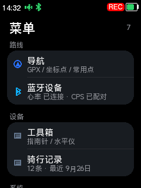 | 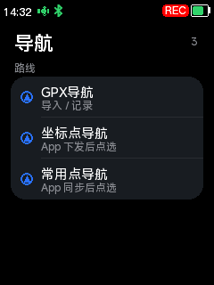 | 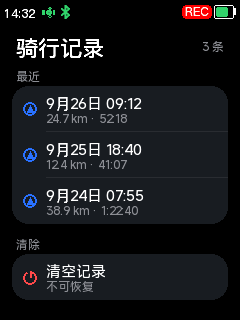 | 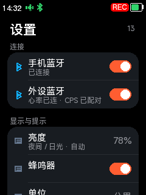 |

App 有明暗两套主题（跟随系统）：

| 深色 | 浅色 |
|---|---|
|  | 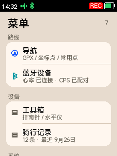 |

更多见 [04-手机App.md](04-手机App.md)。

## 照片

| 已拍 | |
|---|---|
|  | 整机正面、屏幕点亮（导航中）。上边框 `openvela`、下边框 `Helm One` |

还缺这些：

> 🖼️ **待补图** → `images/hw-mounted.jpg` —— 装上车把的照片
> 🖼️ **待补图** → `images/hw-screen-sunlight.jpg` —— 阳光下半透半反屏的可读性（这张最能说明屏幕选型）
> 🖼️ **待补图** → `images/hw-keys.jpg` —— 三个实体键的特写
> 🖼️ **待补图** → `images/hw-back.jpg` —— 背面：支架、充电口、卡槽

需要什么、什么尺寸，见 [images/README.md](images/README.md)。
