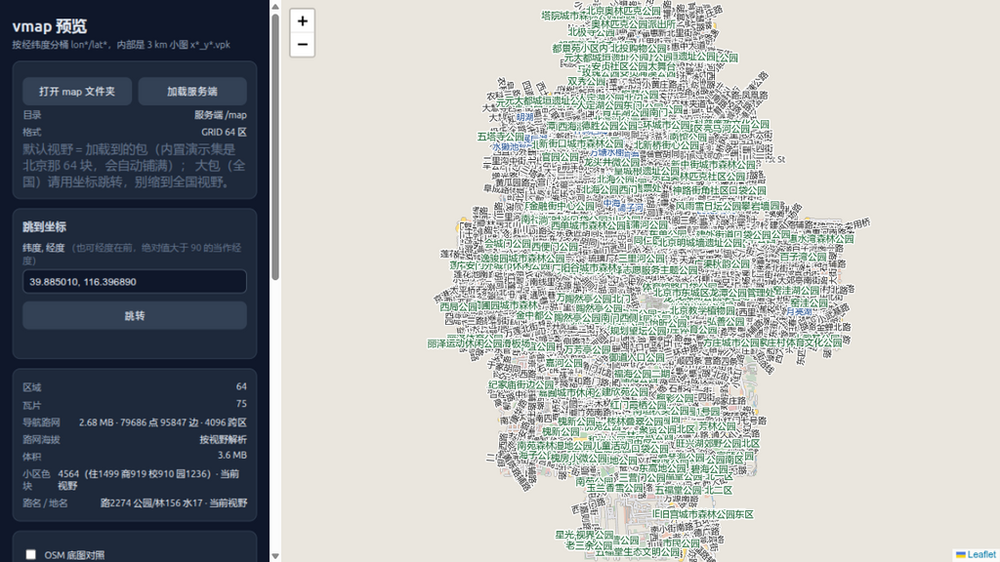

# 地图工具链

车机上跑的是**离线矢量地图**。把 OpenStreetMap 变成设备能用的地图包，是
`04_tools/vmap/` 这套 PC 端工具的活。

## 先看效果（不用生成）

仓库里带了一份**演示地图包**（北京，64 格），所以不跑生成流程也能直接把预览器开起来：

```bash
cd 04_tools/vmap
./view_map.sh                 # 默认就打开内置演示包，浏览器自动弹出
```



左边面板显示这份包的统计：区域数、瓦片数、导航路网的点/边、体积、小区色块、路名地名数量。
右侧就是渲染出来的地图，可以缩放平移。

其他用法：

```bash
./view_map.sh --no-open --port 8791      # 不弹浏览器、指定端口
./view_map.sh /path/to/other/map        # 看别的包
VMAP_CHINA_MAP=/path/to/map ./view_map.sh
```

## 数据长什么样

设备地图按 **3 km 网格**切分，一格一个文件：

```
map/
├── lon883/lat369/x3534_y1476.vpk
├── lon883/lat369/x3534_y1477.vpk
└── ...
```

- 目录名 `lon<ix//4>` / `lat<iy//4>`：每级目录最多放 16 个文件（避免单个目录里堆几万个）。
- 文件名 `x<ix>_y<iy>.vpk`：格子的整数编号，经纬度由固定网格公式反算，不是浮点目录名。
- 一个 `.vpk` 里装了这一格的瓦片、路网、门户（跨格接点）等。

内置演示包是 **北京**，覆盖经度 116.265~116.528 E、纬度 39.777~39.993 N，共 64 格、约 7 MB。
它是固件树里那份全国包的**子集**（逐字节相同）——全国包 7.8 GB / 58 万文件，不入库。

> ⚠️ 固件树里的 `boards/sf32lb52/my_vendor/mkfs/fat/map/**` 是构建产物、被 `.gitignore` 挡着。
> **只有 `04_tools/vmap/map/` 这份是版本化的**，要长期留住的演示数据放这里。

## 生成流程

```
OpenStreetMap（.osm / .osm.pbf）
    │  build_vmap.py        OSM XML → .vt 瓦片
    │  build_vgraph.py      OSM XML → graph.vgrf（路网，供离线算路）
    │  dem.py               SRTM / Terrarium 取海拔
    ▼
vmap/（转换中间产物，随用随生成，不入库）
    │  tools/pack_map.py    瓦片 + 路网 → 设备包
    ▼
设备地图包  →  拷进 <固件树>/boards/sf32lb52/my_vendor/mkfs/fat/map/
```

编排脚本：

| 脚本 | 用途 |
|---|---|
| `make_cities_map.sh` | 当前设备包：滁州 / 南京 / 广州，3 km 网格 |
| `make_chuzhou_map.sh` | 单城 5 km；加 `--install` 直接把结果拷进固件树 |
| `make_china_map.sh` | 全国一次性生成（吃 `china-latest.osm.pbf`，很重） |
| `web/run.sh` | 网页版框选生成器：在地图上框一个区域，直接出包 |

> ⚠️ **有两个 `build_vmap.py`，用途不同**：上层的 `build_vmap.py` 是 OSM XML → `.vt`；
> `tools/build_vmap.py` 是 `.vt` → `.vpk`（`pack_vmap.py` 的别名）。历史原因同名，别混。

## 它怎么找到固件树

这套工具原来住在固件树里（`docs/osm/`），搬出来之后靠 `vmap_paths.py` 解析路径：

1. `$HELMONE_FW`（显式指定）
2. 本仓库布局：`04_tools/vmap/../../02_sw/vendor/vela_sifli`
3. openvela SDK 布局：`../../vendor/vela_sifli` 或 `../../vendor/my_vendor`

所以在本仓库里和在 SDK 里就地跑，都能找到固件树。
搬运时**只改了找路径的方式，转换/打包逻辑逐字节没动**。

## 改界面/改地图也能不烧录看

两个"几秒出图"的预览器：

| 想看什么 | 工具 | 在哪 |
|---|---|---|
| **地图包**（.vpk 渲染出来什么样） | `04_tools/vmap/view_map.sh` | 本仓库，见上 |
| **车机界面**（五个页面、调色板、字体） | `zcode/analysis/helm_preview/` 下的 `pages.py` / `pages_final.py` / `final_set.py` | **在 openvela SDK 树里**（不在本仓库） |

界面预览器值得单独说一句：它**不是示意图**——直接解析固件里 `helm_*.c` 的字体 C 数组、
逐行复刻 `helm_palette.h` 的 `helm_color()` 整数变换，所以预览里的颜色就是板上像素值。
每个脚本跑完都会打印**宽度自检**和**缺字自检**，那两个别忽略：
缺字自检会告诉你文案里哪些字板上根本画不出来（12px/15px 点阵字库有效覆盖只有 546 字）。

> 📝 界面预览器目前只存在于 SDK 树里。如果希望它也跟产品走，可以搬进 `04_tools/` —— 说一声我来做。
