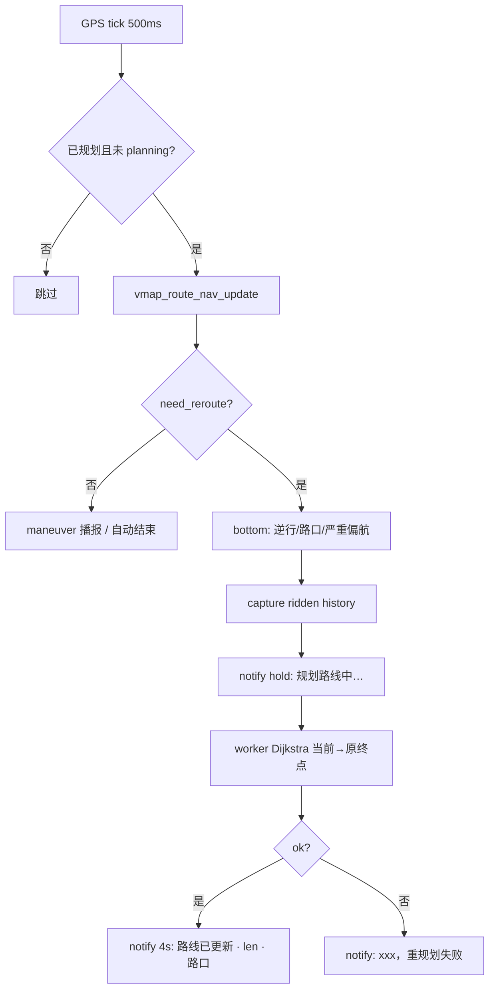

# 离线路网导航（VGRF + Dijkstra）

PC 离线建图 + 设备端图搜索 + 沿路导航。与显示瓦片解耦——`.vt` 仅 PC 构建中间产物；设备只读 **packed map**。

## 设备 map 目录

```
/mnt/lfs/map/
├── map.idx             # 瓦片 + 路网分片表（VIDX）
├── p000.vpk            # 共享 payload（VTIL 瓦片 + VGRF 字节）
├── p001.vpk
└── p002.vpk …
```

瓦片与路网 **共用同一组分片**，不再分 `14/`、`15/`、`graph/` 子目录。

## PC 流水线

```
OSM XML
  ├─ build_vmap.py   → vmap/<z>/<x>/<y>.vt   (构建树，不入设备)
  ├─ build_vgraph.py → graph.vgrf            (VGRF v4 无向边 + SNAP；可选 ELEV)
  └─ pack_map.py     → mkfs/map/             (map.idx + 共享 p*.vpk)
```

```bash
cd vendor/my_vendor/docs/osm
./make_map.sh    # fetch(可选) + convert + graph + pack → mkfs/map
```

### build_vgraph.py（路网）

从同一 OSM 提取 `highway=*` 有向图，写出 **VGRF v2**（含 SNAP 网格；有 DEM 时附 ELEV）：

```bash
.venv/bin/python build_vgraph.py --osm osm/chuzhou.osm --out graph.vgrf
# 可选：--dem-dir /path/to/hgt   --no-dem   --no-dem-fetch
```

| 步骤 | 说明 |
|------|------|
| OSM way → 边 | 按 `oneway` / 双向生成有向边；`motorway`、`bicycle=no` 等标记禁行 |
| **节点缝合 MERGE_M = 12 m** | **仅 PC 构建阶段**：相距 ≤12 m 的 OSM 节点并查集合并为同一 junction。**设备端不再做 12 m 合并**，只读已合并的 VGRF |
| 路权 | 与 `vmap_route.c` 中 `road_weight` 一致（path 90 … service 130） |
| SNAP 网格 | `VGRF_SNAP_CELL_M = 200` m 均匀格；段 magic `SNAP` 附在核心图之后 |
| ELEV | SNAP 之后可选；每路网点一个 `int16` 米。建图时按节点采样 Terrarium（只拉覆盖这些点的瓦片），不保存全国地形网格。 |

> **12 m 与 12° 不是一回事**：12 m 是建图 stitch；12° 是设备端三岔 maneuver 角度阈值（`VMAP_ROUTE_MANEUVER_JUNCTION_DEG`）。

### pack_map.py（统一设备包）

瓦片与 **整份** `graph.vgrf` 打进 **同一组** `p*.vpk`，由 `map.idx` 分别索引：

| 规则 | 说明 |
|------|------|
| 输入 | `-i vmap/`（loose `.vt`）+ `--graph graph.vgrf` |
| 分片上限 | `--pack-size 512000`（默认 512 KiB payload/片） |
| 排序 | 瓦片按 `(z, tileY, tileX)`；graph blob 作为最后一个逻辑对象 `(sort_key=1,0,0,0)` |
| 跨片 | 单片 payload 满则开新 `pNNN.vpk`；**大 graph 可被切成多段**，`map.idx` 的 graph shard 表记录每段 `(packId, offset, size)` |
| 标志 | `map.idx` `flags & VMAP_FLAG_HAS_GRAPH (0x01)` 表示含路网 |
| 仅底图 | 省略 `--graph` 时等同旧 `pack_vmap.py`（无导航） |

设备目录 **扁平**：只有 `map.idx` + `p000.vpk` …，**无** `14/`、`graph/` 子目录。

## 二进制格式

| 文件 | Magic | 说明 |
|------|-------|------|
| `map.idx` | `VIDX` | pack_limit、瓦片表 (z,x,y→shard)、VGRF 分片表 |
| `pNNN.vpk` | `VPKG` | 16B 头 + payload（瓦片 VTIL 或 VGRF 片段） |
| `graph.vgrf` | `VGRF` | PC 中间路网（打包进共享 `p*.vpk`） |

### VGRF 路网布局

| 版本 | 头长 | 说明 |
|------|------|------|
| v1 | 48 B | magic + ver + counts + bbox(4×double)，节点紧跟其后 |
| v2 | 52 B | v1 前 48 B + `snap_off`(u32)；边 16 B，`name_off` uint16（`0xFFFF` 无名） |
| v3 | 52 B | 同 v2 头；边 18 B，`name_off` uint32（`0xFFFFFFFF` 无名）。设备可读 v1–v3 |
| v4 | 52 B | 同 v3 边宽；**无向边**（A–B 只存一条，`ONEWAY` 表示仅 `from→to`）。磁盘**不写** `adj_off`/`adj_edges`，设备加载时展开出边。固件仍可读 v2/v3 |

节点后顺序：

- **v2/v3**：`nodes[]` → `edges[]` → `adj_off[]` → `adj_edges[]` → 路名字符串池 → SNAP →（可选）ELEV
- **v4**：`nodes[]` → `edges[]` → 路名字符串池 → SNAP →（可选）ELEV

边记录：v2 为 16 B，v3/v4 为 18 B。切片后的区域路名池上限 **128 KiB**。

SNAP 段（约 200 m 均匀网格）：快速 snap 候选，无 SNAP 时设备回退 O(n) 全图扫描。

ELEV 段（12 B 头 + `node_count × int16`）：路网点海拔。`INT16_MIN` 为未知。显示瓦片 `.vt` 仍是二维坐标，高度只在路网里。

## 设备端模块

| 模块 | 职责 |
|------|------|
| `vmap_tile_index` | 读 `map.idx`（瓦片 + graph 分片表） |
| `vmap_tile_cache` | 读根目录 `p*.vpk` 取 VTIL |
| `vmap_route_graph` | 按 `map.idx` graph 段拼接并解析 VGRF |
| `vmap_route` | **Dijkstra 最短路** + 折线 / maneuver 生成 + 路线绘制 |
| `vmap_route_worker` | pthread 后台跑 `vmap_route_compute`，不阻塞 LVGL |
| `vmap_route_nav` | 沿路跟踪、偏航、下一 maneuver、剩余距离 |

代码锚点（bicycle）：

- `bicycle/src/vmap/vmap_route.c` — 规划核心
- `bicycle/src/vmap/vmap_route_graph.c` — 图加载与 snap
- `bicycle/src/vmap/vmap_route_worker.c` — 后台 worker
- `bicycle/src/vmap/vmap_route_nav.c` — 导航状态
- `docs/osm/build_vgraph.py` — PC 建图

---

## 路径规划算法

### 结论（当前实现）

**不是 A\***。设备端使用 **多源多汇、加权 Dijkstra + 二叉小根堆**。

历史上曾尝试 A\* / SPFA；在 SF32LB52 上因堆行为与图解析问题不稳定，已统一为 Dijkstra（边权非负，正确性简单，实现更稳）。

UART 日志关键字：`compute: Dijkstra seeds`、`Dijkstra ok` / `Dijkstra fail`。

### 端到端流程


1. **加载图**：`vmap_route_graph_load_from_map_dir()` 读 VGRF，校验邻接与边索引。
2. **Snap**：起终点各取最多 `VMAP_ROUTE_SNAP_K`(8) 个可路由节点；半径 tier 150 m → 800 m（`VMAP_ROUTE_SNAP_POOL_M`）。
3. **搜索**：`route_search_targets()` — 所有起点候选 `dist=0` 入堆，扩展至命中任一终点候选。
4. **建路**：沿 `prev[]` 回溯 → WGS 折线；junction 处生成 maneuver（左转/右转/三岔直行等）。
5. **导航**：`vmap_route_nav_update()` 投影 GPS 到折线，算剩余距离与下一 maneuver；地图从 **当前 GPS anchor** 画剩余蓝线。

### 图模型

- **节点**：OSM 路口（junction），存 `(lon_e7, lat_e7)`。
- **无向边（v4）**：A–B 存一条；无 `ONEWAY` 时双向可走；`ONEWAY` 时仅 `from→to`。v2/v3 仍为有向边。
- **邻接**：forward-star，`adj_off[i]..adj_off[i+1]` 指向出边索引。v4 在设备加载时由无向边展开（双向边出现在两端邻接里）。
- **搜索**：沿出边走到**另一端点**（`vmap_route_graph_edge_other`）；权重为 ∞ 的边不扩展。

### 边权（自行车偏好最短）

```
cost(e) = length_cm × road_weight(class) / 100
```

| 路类 | `road_weight` | 说明 |
|------|---------------|------|
| motorway | 0 | 不可通行（cost = ∞） |
| path | 90 | 更偏好 |
| secondary / tertiary | 100 | 默认 |
| residential | 110 | |
| primary | 120 | |
| service | 130 | 更不偏好 |
| `VGRF_EDGE_NO_BIKE` | — | cost = ∞ |

目标为 **加权最短路径**（距离 × 路型惩罚），不是纯几何最短。

### Snap（起终点挂接）

| 参数 | 值 | 含义 |
|------|-----|------|
| `VMAP_ROUTE_SNAP_M` | 150 m | 首选 snap 半径 |
| `VMAP_ROUTE_SNAP_POOL_M` | 800 m | 扩大搜索池 |
| `VMAP_ROUTE_SNAP_MAX_M` | 4000 m | 硬上限 |
| `VMAP_ROUTE_SNAP_K` | 8 | 每端最多候选数 |

- 候选按距离排序，且须至少有一条可路由出边。
- VGRF v2 的 SNAP 网格按 ~200 m 单元索引局部节点；v1 或无 SNAP 时线性扫描全图节点。

### Dijkstra 细节

函数：`route_search_targets()`（`vmap_route.c`）

| 项目 | 实现 |
|------|------|
| 算法 | Dijkstra，非负边权松弛 |
| 多源 | 所有 `src_cands[]` 同时 `dist=0` 入堆 |
| 多汇 | 扩展过程中命中任一 `dst_cands[]` 即成功退出 |
| 堆 | 二叉 min-heap，键 = `dist[u]` |
| 堆容量 | `n + edge_count/4 + 64`（懒松弛，允许多次入堆） |
| 状态 | `dist[]`、`closed[]`、`prev[]` |
| 内存 | 单次规划 scratch 经 `malloc`（kumm PSRAM），job 结束释放 |
| 图缓冲 | VGRF 整图 `malloc` 加载，与 scratch 分离 |

伪代码：

```
初始化 dist[v]=∞, prev[v]=∅
对每个 snap 起点 s: dist[s]=0, push(s)
while heap 非空:
  u = pop_min()
  if closed[u]: continue
  closed[u] = true
  if u ∈ dst_cands: 成功，break
  对 u 每条出边 (u→v, w):
    if nd = dist[u]+w < dist[v]:
      dist[v]=nd, prev[v]=u, push(v)
```

与 A\* 对比：无启发式 `h`；不朝终点方向剪枝；实现与内存行为更简单，适合当前 MCU + 大图（~1.5 万节点级）。

### 折线与 Maneuver

- **折线**：回溯 `prev` 得节点序列，按 travel 方向输出 `(lon,lat)` 点列（最多 `VMAP_ROUTE_MAX_PTS` = 2048）。
- **Maneuver 表**（最多 64 条）：
  - `START`：路径起点（不顶栏播报）。
  - **起点路口**：用规划原点 `(from_lon, from_lat)` 与第一段路 bearing 生成 departure 转向（`along_m=0`）。
  - 中间 junction：`i≥1` 处比较入射/出射 bearing + 节点出度；≥25° 或三岔 ≥12° 生成左转/右转/掉头等；**三岔及以上直行**也会生成 `STRAIGHT` 并播报。
  - `ARRIVE`：终点，剩余 ≤45 m 时提示到达。
- **播报**：距下一 maneuver ≤ `VMAP_ROUTE_MANEUVER_ANNOUNCE_M`（80 m）时顶栏 `lv_pm_notify_show`。

### 导航跟踪

- `along_m`：GPS 投影到折线的沿路距离；若在 polyline 起点之前，用 anchor→投影点距离修正（`vmap_route_effective_along_m`）。
- `remain_m = total_m - along_m`（可因修正为负的 along 而略大于几何总长）。
- `off_route_m`：GPS 到规划折线的垂直距离（Haversine）。
- **绘制**：蓝色折线（`VMAP_ROUTE_LINE_RGB565`）从 **当前 GPS anchor** 画到终点，已走过段不画；重规划后与已骑轨迹重合段用红色（`VMAP_ROUTE_RIDDEN_RGB565`，匹配容差 25 m）。
- **自动结束**：剩余距离 ≤ `VMAP_ROUTE_ARRIVE_M`（45 m）且车速 > `VMAP_ROUTE_END_MIN_SPEED_KPH`（3 km/h）时，调用 `map_page_nav_stop()` 清除路线 overlay 与导航 UI（继续骑行场景）。

### 偏航检测与自动重规划

阈值来自 `bicycle_config.nav_off_route_m`（默认 **50 m**，NSH/配置可调，最小 10 m）。由 `vmap_route_nav_set_off_route_threshold()` 在每次规划前注入。

| 条件 | 累积量 | 触发 reason | 界面 brief |
|------|--------|-------------|------------|
| **逆行** | 移动方向与当前路段 bearing 夹角 **>90°**，沿路累积 ≥ 阈值 | `VMAP_ROUTE_REROUTE_OPPOSITE` | `逆行偏航` |
| **过路口偏航** | 已通过 START 以外 maneuver，且 `off_route_m > VMAP_ROUTE_OFF_M`(35 m)；移动 vs 路线 bearing 超过动态角限，沿路累积 ≥ 阈值 | `VMAP_ROUTE_REROUTE_JUNCTION_ACCUM` | `路口偏航` |
| **严重偏航** | 已过路口且 `off_route_m ≥ 2×` 阈值 | `VMAP_ROUTE_REROUTE_JUNCTION_FAR` | `严重偏航`（**立即**重规划，不再看角度） |

**过路口动态角限**（`nav_junction_angle_limit_deg`）：

- `off_m ≤ 1×阈值`：角限 90°（与逆行判定一致）
- `1× ~ 2×阈值`：90° 线性降至 0°
- `≥ 2×阈值`：走「严重偏航」分支

其他规则：

- 车速 ≥ 3 km/h 且步长 ≥ 1 m 才累积偏航距离；`off_route_m ≤ 17.5 m`（0.5×OFF_M）时清零路口累积。
- 触发后：`vmap_route_capture_ridden_history()` 保存已骑折线 → worker 从 **当前 GPS** 到 **原终点** 重算 → 新线与历史重合段标红。
- MTP / LiveMap 被盖住 / `myvendor_mtp_lfs_quiesce()` 时不更新导航、不发起重规划。



### 界面提示（LiveMap）

overlay 由 `lv_pm_overlay` 管理：**notify**（顶栏卡片）与 **bottom**（底部短条）职责分离。

| 时机 | 通道 | 文案示例 |
|------|------|----------|
| 用户/NSH 开始规划 | notify **hold** | 标题 `导航`，正文 `规划路线中…` |
| 偏航触发瞬间 | **bottom**（duration=0 直至被覆盖） | `逆行偏航` / `路口偏航` / `严重偏航` |
| 偏航后进入 worker | notify **hold** | `规划路线中…`（覆盖 bottom 上方区域，bottom 仍保留偏航标签） |
| 首次规划成功 | notify 4s | `路线 1234 m · 5 路口` |
| 重规划成功 | notify 4s | `路线已更新 · 1234 m · 5 路口` |
| 规划失败 | notify 4s | `路线规划失败` 或 `{偏航原因}，重规划失败` |
| 距下一 maneuver ≤80 m | notify 4s | `80m 左转 · 某某路`（无路名则仅 `80m 左转`） |
| 自动到达结束 | bottom | `导航已结束` |

实现锚点：`map_page.c`（`map_page_nav_plan_begin` / `plan_done` / GPX timer）；brief 文案 `vmap_route_reroute_reason_brief()`。

> **布局注意**：`lv_pm_notify_show_hold` 会刷新 overlay chrome；bottom 卡片须带 `LV_OBJ_FLAG_FLOATING` 并重新 `LV_ALIGN_BOTTOM_MID`（见 `lv_pm_overlay.c` `overlay_bottom_layout_card`），否则 notify 出现后 bottom 可能漂到左上角。

### 线程与 UI

- `vmap_route_worker`：独立 pthread（栈 `CONFIG_VMAP_ROUTE_WORKER_STACK` = 32 KB），`submit` 时快照起终点坐标。
- 规划完成回调在 LVGL 线程 `map_page_nav_plan_done` 中 `apply` 路线并重绘地图。
- 规划期间 LiveMap **pause**（不销毁 tile cache）；MTP quiesce 时图不读 LFS、导航规划被 `plan_begin` 拒绝。

### 主要配置常量

| 来源 | 常量 | 默认 | 说明 |
|------|------|------|------|
| `bicycle_config.h` | `nav_off_route_m` | 50 m | 偏航累积 / 严重偏航倍数阈值 |
| `vmap_config.h` | `VMAP_ROUTE_OFF_M` | 35 m | 过路口偏航判定的最小离线路距离 |
| `vmap_config.h` | `VMAP_ROUTE_SNAP_*` | 150/800/4000 m | Snap 半径 tier |
| `vmap_config.h` | `VMAP_ROUTE_MANEUVER_*` | 25° / 12° / 80 m | 转向生成与播报距离 |

完整列表见 `bicycle/src/vmap/vmap_config.h` 中 `VMAP_ROUTE_*`。

---

## 调试

```text
bicycle_nsh nav <to_lon> <to_lat>              # 起点用当前 GNSS
bicycle_nsh nav <from_lon> <from_lat> <to_lon> <to_lat>
```

典型 `[nav]` 日志顺序：

```
graph parse: v2 nodes=… edges=… snap=1
compute: snap start / snap dest
compute: Dijkstra seeds src=… dst_lead=…
Dijkstra ok expanded=… g_cost=…
path: graph_nodes=… polyline_pts=…
maneuvers: N steps
plan_done / nav_apply
off-route reroute: … reason=…   # 偏航触发时
偏航重规划 … reason=逆行偏航    # map_page plan_begin
```

## worker 卡死与自愈（2026-09-19）

**现象**：长时间导航后"再也不规划"（`ctl nav ...` 与 UI 都失败），只能重启设备。

**现场**：`route_worker` 线程进入 `has_job=1 / running=0` 的冻结态（线程自称 `alive=1`
却不再取件），而 `vmap_route_worker_busy()` 是 `has_job || running`，于是恒真、
**每次 `submit` 都返回 false**。注意 **`ps` 不列这个 PSRAM 栈的 pthread**，
"ps 里没有 route_worker"不能当作线程已死的证据；冻结的确切位置仍未查明
（最可能是内核里的 sem/mutex 等待丢唤醒）。同一时刻会伴随
`wdog: clipped corrupt g_wdactivelist`（另一条独立未结案的线）。

**自愈**（`vmap_route_worker.c`）：卡死判定取三个"最后进度时刻"的最新值 —— worker 自己的
`alive_ticks`（循环顶/取件/交付）、规划器每次 yield 的 `vmap_route_plan_progress_ticks()`
（约 4 ms 一次，**正常慢规划不会被误判**）、job 排队时刻；超过
`VMAP_ROUTE_WORKER_STUCK_MS`（15 s）无进度即判死，`route_worker_revive()` 换一块
**新的 PSRAM 栈**起新线程（旧栈可能还在用，只能泄漏，存 `g_dead_stacks[]`，上限
`VMAP_ROUTE_WORKER_REVIVE_MAX`=3，shutdown 释放），并清 `job.cb` 让旧结果走既有的
`skip_done` 丢弃。实测第 25 s 的那次提交即 `worker: stalled … -> revive` 并成功出结果。

**诊断命令**（`ctl nav`，脱离 App 的规划自测）：

```
ctl nav plan|roll|both <from_lon> <from_lat> <to_lon> <to_lat>
ctl nav status      # worker_busy / alive / revives / steps
ctl nav stop        # cancel
ctl nav wedge       # 故障注入：造"job 挂着没人取"，验证自愈
```

回调是在 **LVGL/UI 线程**上送达的（worker 收尾走 `lv_async_call`），所以命令超时后
回调若晚到只打印、不再写栈。图要按区域装（`vmap_map_catalog_load` + `find_region` +
`vmap_route_graph_load_from_region`）。
